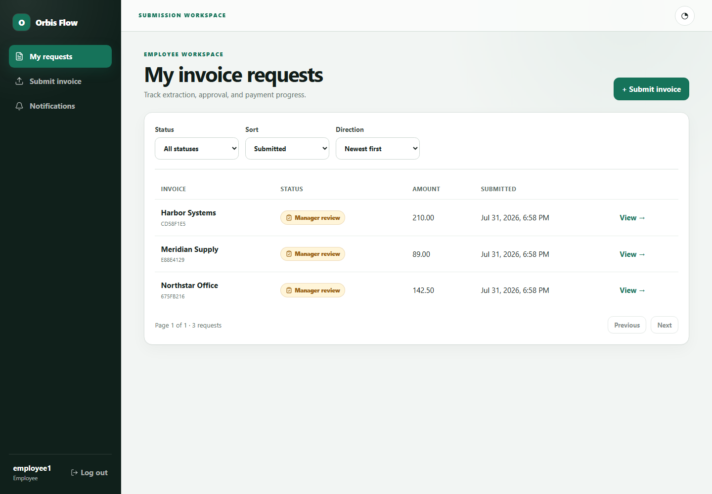
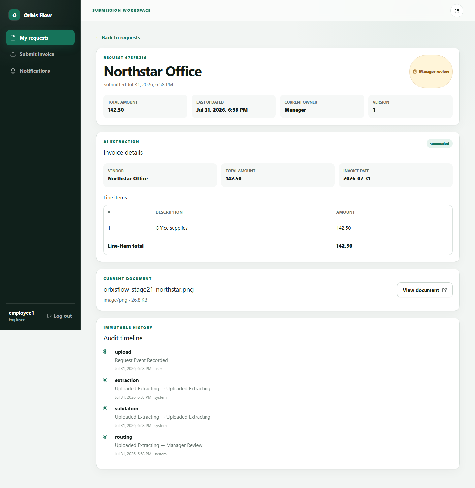
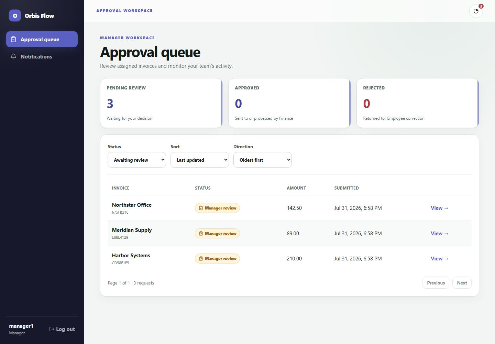
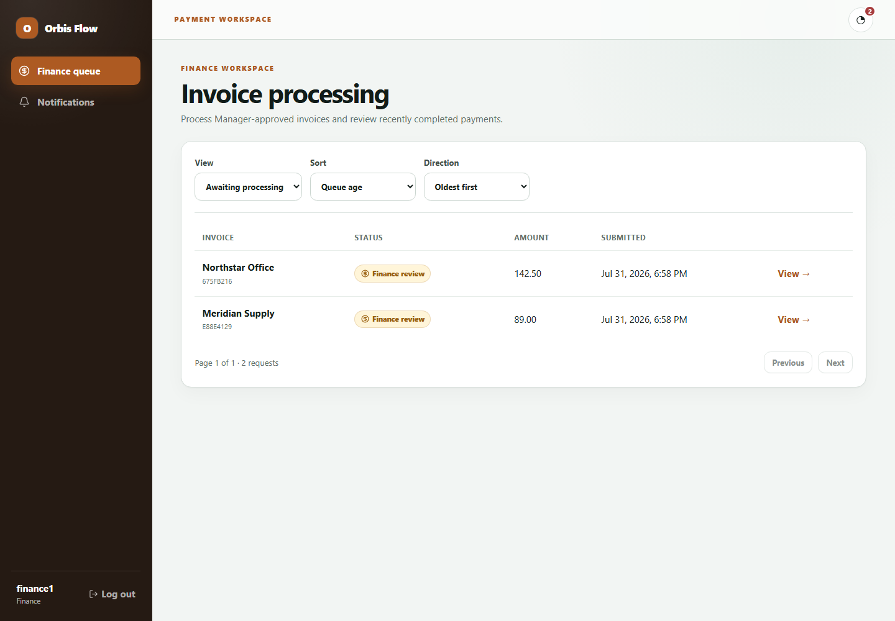

# Orbis Flow

**AI-assisted invoice approval workflow platform for traceable, role-based processing.**

[](https://nextjs.org/)
[](https://spring.io/projects/spring-boot)
[](https://fastapi.tiangolo.com/)
[](https://www.postgresql.org/)
[](https://redis.io/)
[](https://docs.docker.com/compose/)

## Overview

Orbis Flow replaces email, spreadsheets, and repeated invoice data entry with one accountable workflow for Employees, Managers, and Finance teams. An Employee uploads an invoice, the OCR service extracts and validates its fields, the assigned Manager approves or rejects it, and Finance records the payment as paid or scheduled. Role-scoped dashboards, in-app notifications, optimistic locking, and an append-only audit trail keep each handoff visible and controlled. The MVP deliberately implements one fixed workflow well rather than a configurable process engine.

> **Project status:** The three-role backend and frontend are implemented and tested, and the complete stack runs locally with Docker Compose. AWS production deployment is pending free-tier availability. **Live demo: coming soon after AWS deployment.**

**Known dependency issue:** `npm audit` currently reports three high-severity advisories in Next.js 16.2.11's bundled PostCSS/sharp dependencies. The available automated fix is a breaking downgrade, so this is being monitored for an upstream-compatible release.

## Key features

### Employee

- Upload PDF, JPG, or PNG invoices up to 10 MB with MIME, size, and file-signature validation.
- Review OCR-extracted vendor, invoice date, total, and line-item data.
- Correct flagged extraction data, replace a document, retry extraction, and resubmit.
- Track only owned requests, audit history, document access, and notifications.

### Manager

- Review only requests routed to the assigned Manager.
- Inspect the source document, extracted data, and audit history.
- Approve eligible invoices or reject them with a required reason.
- Monitor a paginated approval queue and scoped team-activity totals.

### Finance

- Review Manager-approved invoices in the Finance queue.
- Mark an eligible invoice as `paid` or `scheduled`.
- View processed requests, payment details, documents, and audit history.
- Process any eligible Finance-stage request without a per-request Finance assignment.

Across all roles, Spring Security enforces JWT authentication, subject-bound CSRF protection, deny-by-default RBAC, ownership rules, workflow-state checks, and version-conflict handling.

## Architecture

```text
Browser
  |-- pages --------------------------> Next.js
  `-- authenticated business API ----> Spring Boot
                                           |-- PostgreSQL
                                           |-- Redis
                                           |-- private S3 storage
                                           `-- internal OCR request --> FastAPI + Tesseract
```

Spring Boot is the sole business API and the only service allowed to access PostgreSQL, Redis, and object storage. FastAPI is isolated behind Spring Boot and cannot be called by the browser, keeping OCR concerns and storage credentials outside the client trust boundary. See the [system architecture](docs/architecture.md) for the full request, authentication, file, and consistency flows.

## Tech stack

| Layer | Technologies |
| --- | --- |
| Frontend | Next.js 16, React 19, TypeScript, Tailwind CSS, shadcn/ui patterns, Lucide icons |
| Backend | Java 17, Spring Boot 3.5, Spring Security, JDBC, Flyway, JWT |
| AI service | Python 3.11, FastAPI, Tesseract OCR via pytesseract, Pillow, pypdfium2 |
| Data | PostgreSQL 17, Redis 7, private S3-compatible object storage |
| Delivery and QA | Docker, Docker Compose, GitHub Actions, Maven, Testcontainers, Vitest, Playwright, pytest, Ruff |

## Run locally

### Prerequisites

- [Git](https://git-scm.com/)
- [Docker Desktop](https://www.docker.com/products/docker-desktop/) or Docker Engine with the Compose plugin
- At least 6 GB of memory available to Docker for parallel image builds and OCR
- For invoice upload: a private AWS S3 bucket or compatible S3 endpoint and access credentials

### 1. Clone and configure

```sh
git clone https://github.com/ParthrChandurkar/orbisflow-platform.git
cd orbisflow-platform
cp .env.example .env
```

On Windows PowerShell, replace the last command with:

```powershell
Copy-Item .env.example .env
```

Edit the root `.env` before starting:

```dotenv
# Required for browser login over local plain HTTP only. Use true behind production HTTPS.
SECURE_COOKIES=false

# Required for invoice upload/extraction.
S3_BUCKET=your-private-bucket
AWS_REGION=your-bucket-region
AWS_ACCESS_KEY_ID=your-local-development-access-key
AWS_SECRET_ACCESS_KEY=your-local-development-secret

# Set these only for an S3-compatible local endpoint.
S3_ENDPOINT=
S3_PATH_STYLE=false
```

The Compose stack reads the root `.env`. The service-level `.env.example` files under `frontend/`, `backend/`, and `ai-service/` are templates for running those services outside Compose. Do not commit populated `.env` files.

### 2. Build and start

```sh
docker compose up --build -d
docker compose ps
```

Open [http://localhost:3000](http://localhost:3000). Health endpoints are available at:

- Spring Boot: [http://localhost:8080/api/v1/health](http://localhost:8080/api/v1/health)
- FastAPI: [http://localhost:8000/internal/v1/health](http://localhost:8000/internal/v1/health)

Flyway creates the schema and seed accounts on the first clean start. Test usernames and the shared local-only test password are documented in [`V2__seed_test_users.sql`](backend/src/main/resources/db/migration/V2__seed_test_users.sql); use an `employee*`, `manager*`, or `finance*` account for the corresponding workspace. These credentials are development fixtures and must not be used in a deployed environment.

View logs or stop and remove the containers with:

```sh
docker compose logs -f
docker compose down
```

Use `docker compose down -v` only when you intentionally want to delete local PostgreSQL and Redis volumes and re-run all migrations from a clean database.

## Product screenshots

### Employee request dashboard



### Extracted invoice and audit detail



### Manager approval queue



### Finance processing queue



## Testing

The repository includes:

- Spring Boot integration tests using JUnit, MockMvc, real PostgreSQL through Testcontainers, and real OCR-service containers for extraction paths.
- FastAPI unit and API tests using pytest, plus Ruff and Python bytecode checks in CI.
- Frontend unit tests using Vitest and browser-level, three-role workflow coverage using Playwright.
- GitHub Actions jobs that lint/build the frontend, run the Maven verification suite, and validate the AI service on every pull request to `main`.

```sh
# Backend integration suite (Docker required for Testcontainers)
cd backend
mvn verify
cd ..

# AI service
cd ai-service
python -m pytest -q
cd ..

# Frontend unit and browser suites
cd frontend
npm test
npm run test:e2e
```

## Design documentation

The complete design trail is available in [`docs/`](docs/), including:

- [Product requirements](docs/PRD.md)
- [System architecture](docs/architecture.md)
- [RBAC permission model](docs/rbac.md)
- [User stories and traceability](docs/user-stories.md)
- [Database schema](docs/db-schema.md)
- [Backend API contract](docs/backend-api.md)
- [Frontend and navigation design](docs/frontend.md)
- [Repository structure](docs/folder-structure.md)

## Roadmap

- Deploy the existing containers and managed data services to AWS when the required free-tier capacity is available.
- Add deployment automation and production observability around the current three-service architecture.
- Re-evaluate deliberately deferred capabilities after MVP validation: OAuth/enterprise SSO, configurable workflows, real-time notifications, and RAG or natural-language search.

## License

No open-source license is currently included. The repository is available for portfolio review; all rights are reserved unless a license is added later.

## Author

**Parth Chandurkar** — [GitHub](https://github.com/ParthrChandurkar)
