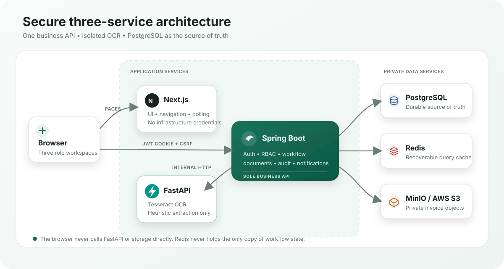

<div align="center">

# 🌐 Orbis Flow

### AI-assisted invoice approval, from upload to payment—with every handoff traceable.

[](https://nextjs.org/)
[](https://spring.io/projects/spring-boot)
[](https://fastapi.tiangolo.com/)
[](https://www.postgresql.org/)
[](https://redis.io/)
[](https://docs.docker.com/compose/)
[](https://github.com/ParthrChandurkar/orbisflow-platform/actions/workflows/ci.yml)

[🎯 Highlights](#highlights) · [✨ Features](#features) · [🏗️ Architecture](#architecture) · [🚀 Run locally](#run-locally) · [🧪 Testing](#testing) · [📚 Documentation](#documentation)

</div>

## 💡 What it solves

Orbis Flow replaces invoice handoffs scattered across email and spreadsheets with one accountable workflow for Employees, Managers, and Finance teams. It extracts invoice data with OCR, routes valid submissions to the assigned Manager, moves approvals to Finance, and records every material action in an audit trail.

> 📄 **Employee uploads** → 🤖 **AI extracts & validates** → 👔 **Manager decides** → 💳 **Finance processes** → 🧾 **Audit trail records**

| 3 fixed roles | 1 governed workflow | 3 application services | Zero external local credentials |
| :---: | :---: | :---: | :---: |
| Employee · Manager · Finance | Deliberate MVP scope | Next.js · Spring Boot · FastAPI | Docker Compose + MinIO |

## 🚦 Project status

| Area | Current state |
| --- | --- |
| ✅ Product | Full three-role backend and frontend implemented and tested |
| 🐳 Local runtime | Complete workflow runs through Docker Compose, including local object storage |
| ☁️ Production | AWS deployment pending free-tier availability |
| 🌍 Live demo | Coming after AWS deployment—no placeholder or inactive demo link |

<a id="highlights"></a>

## 🎯 Why this project stands out

- **End-to-end ownership:** product requirements, user stories, RBAC, architecture, schema, API contract, implementation, tests, and UX were designed as one coherent system.
- **Business-first automation:** OCR reduces manual entry, while deterministic validation and a fixed state machine keep approval decisions explainable.
- **Security by construction:** private document storage, short-lived access links, server-side authorization, CSRF protection, immutable audit history, and least-privilege database grants are built into the design.
- **Production-minded delivery:** reproducible local infrastructure, versioned migrations, optimistic concurrency, correlation IDs, health checks, and three independent CI jobs support confident change.

<a id="features"></a>

## ✨ Role-based experience

### 👩‍💻 Employee

- 📤 Upload PDF, JPG, or PNG invoices up to 10 MB with MIME, size, and file-signature validation.
- 🔎 Review OCR-extracted vendor, invoice date, total, and line-item data.
- ✏️ Correct flagged data, replace a document, retry extraction, and resubmit.
- 🔐 Track only owned requests, document access, audit history, and notifications.

### 👔 Manager

- 📥 Review only requests routed to the assigned Manager.
- 🧾 Inspect the source document, extracted data, and audit history.
- ✅ Approve eligible invoices or reject them with a required reason.
- 📊 Monitor a paginated approval queue and scoped team-activity totals.

### 💼 Finance

- 📋 Review Manager-approved invoices in the Finance queue.
- 💳 Mark an eligible invoice as `paid` or `scheduled`.
- 🔍 View processed requests, payment details, documents, and audit history.
- 🔄 Process any eligible Finance-stage request without a per-request Finance assignment.

> 🛡️ Across all roles, Spring Security enforces JWT authentication, subject-bound CSRF protection, deny-by-default RBAC, ownership rules, workflow-state checks, and optimistic-lock conflicts.

<a id="architecture"></a>

## 🏗️ Architecture



Spring Boot is the sole business API and the only service allowed to access PostgreSQL, Redis, and object storage. FastAPI is isolated behind Spring Boot and cannot be called by the browser, keeping OCR concerns and storage credentials outside the client trust boundary. PostgreSQL remains the durable source of truth; Redis is never the only copy of workflow state. See the [system architecture](docs/architecture.md) for the full request, authentication, file, and consistency flows.

## 🧰 Tech stack

| Layer | Technologies |
| --- | --- |
| Frontend | Next.js 16, React 19, TypeScript, Tailwind CSS, shadcn/ui patterns, Lucide icons |
| Backend | Java 17, Spring Boot 3.5, Spring Security, JDBC, Flyway, JWT |
| AI service | Python 3.11, FastAPI, Tesseract OCR via pytesseract, Pillow, pypdfium2 |
| Data | PostgreSQL 17, Redis 7, MinIO locally, private AWS S3 in production |
| Delivery and QA | Docker, Docker Compose, GitHub Actions, Maven, Testcontainers, Vitest, Playwright, pytest, Ruff |

<a id="run-locally"></a>

## 🚀 Run locally

### ✅ Prerequisites

- [Git](https://git-scm.com/)
- [Docker Desktop](https://www.docker.com/products/docker-desktop/) or Docker Engine with the Compose plugin
- At least 6 GB of memory available to Docker for parallel image builds and OCR
- Ports 3000, 5432, 6379, 8000, 8080, 9000, and 9001 available locally

### 1️⃣ Clone and configure

```sh
git clone https://github.com/ParthrChandurkar/orbisflow-platform.git
cd orbisflow-platform
cp .env.example .env
```

On Windows PowerShell, replace the last command with:

```powershell
Copy-Item .env.example .env
```

No external credentials are required. The copied defaults use a local MinIO container, create a private `orbisflow-invoices` bucket automatically, and use non-production development credentials. The Compose stack reads the root `.env`; service-level `.env.example` files are templates for running services outside Compose. Do not commit populated `.env` files.

### 2️⃣ Build and start

```sh
docker compose up --build -d
docker compose ps
```

### 3️⃣ Open the app

Open **[http://localhost:3000](http://localhost:3000)**. Health endpoints are available at:

- Spring Boot: [http://localhost:8080/api/v1/health](http://localhost:8080/api/v1/health)
- FastAPI: [http://localhost:8000/internal/v1/health](http://localhost:8000/internal/v1/health)
- MinIO console: [http://localhost:9001](http://localhost:9001)

Flyway creates the schema and seed accounts on the first clean start. Test usernames and the shared local-only test password are documented in [`V2__seed_test_users.sql`](backend/src/main/resources/db/migration/V2__seed_test_users.sql); use an `employee*`, `manager*`, or `finance*` account for the corresponding workspace. These credentials are development fixtures and must not be used in a deployed environment.

Production deployment replaces the local MinIO endpoint and development credentials with a private AWS S3 bucket and credentials supplied entirely through environment variables; application code does not change.

View logs or stop and remove the containers with:

```sh
docker compose logs -f
docker compose down
```

Use `docker compose down -v` only when you intentionally want to delete local PostgreSQL, Redis, and MinIO data and re-run all migrations from a clean database.

## 🖼️ Product tour

<table>
  <tr>
    <td width="50%" align="center">
      <strong>👩‍💻 Employee dashboard</strong><br><br>
      
    </td>
    <td width="50%" align="center">
      <strong>🔎 Invoice detail</strong><br><br>
      
    </td>
  </tr>
  <tr>
    <td width="50%" align="center">
      <strong>👔 Manager queue</strong><br><br>
      
    </td>
    <td width="50%" align="center">
      <strong>💼 Finance queue</strong><br><br>
      
    </td>
  </tr>
</table>

<a id="testing"></a>

## 🧪 Testing

The repository includes:

- Spring Boot integration tests using JUnit, MockMvc, real PostgreSQL through Testcontainers, and real OCR-service containers for extraction paths.
- FastAPI unit and API tests using pytest, plus Ruff and Python bytecode checks in CI.
- Frontend unit tests using Vitest and browser-level, three-role workflow coverage using Playwright.
- GitHub Actions jobs that lint/build the frontend, run the Maven verification suite, and validate the AI service on every pull request to `main`.

```sh
# Backend integration suite (Docker required for Testcontainers)
cd backend
mvn verify
cd ..

# AI service
cd ai-service
python -m pytest -q
cd ..

# Frontend unit and browser suites
cd frontend
npm test
npm run test:e2e
```

<a id="documentation"></a>

## 📚 Design documentation

The complete design trail is available in [`docs/`](docs/), including:

- [Product requirements](docs/PRD.md)
- [System architecture](docs/architecture.md)
- [RBAC permission model](docs/rbac.md)
- [User stories and traceability](docs/user-stories.md)
- [Database schema](docs/db-schema.md)
- [Backend API contract](docs/backend-api.md)
- [Frontend and navigation design](docs/frontend.md)
- [Repository structure](docs/folder-structure.md)

## 🗺️ Roadmap

- Deploy the existing containers and managed data services to AWS when the required free-tier capacity is available.
- Add deployment automation and production observability around the current three-service architecture.
- Re-evaluate deliberately deferred capabilities after MVP validation: OAuth/enterprise SSO, configurable workflows, real-time notifications, and RAG or natural-language search.

## 📄 License

No open-source license is currently included. The repository is available for portfolio review; all rights are reserved unless a license is added later.

## 👤 Author

**Parth Chandurkar** — [GitHub](https://github.com/ParthrChandurkar)
