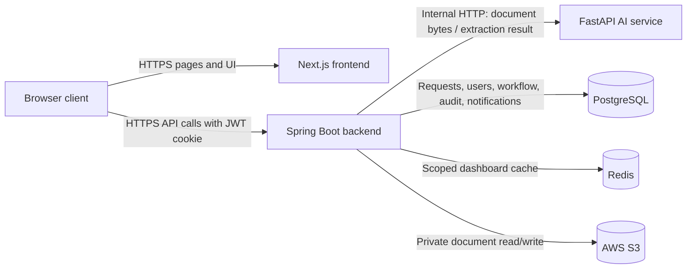

# Orbis Flow — Stage 4 System Architecture

- **Scope:** Three application services for the MVP
- **Source:** `docs/PRD.md`, `docs/rbac.md`, and `docs/user-stories.md`
- **Fixed stack:** Next.js, Spring Boot, FastAPI, PostgreSQL, Redis, AWS S3, JWT, AWS, Docker, Docker Compose, GitHub Actions

## 1. System Context

Spring Boot is the sole business API and the only service that directly accesses PostgreSQL, Redis, or S3. Next.js renders the UI; browser business-data calls go only to Spring Boot. FastAPI accepts calls only from Spring Boot and has no database, Redis, or S3 access. The browser receives no AI-service route, storage/database credentials, or general S3 access. These are security boundaries, not deployment conveniences. (AUTH-02, AUTH-03, DOC-04, AI-03; PRD §7 Security)

## 2. Spring Boot ↔ FastAPI Extraction Contract

Extraction is **asynchronous from the browser's perspective and synchronous per internal attempt**:

1. Spring Boot accepts and stores the upload, persists the Request and extraction state, and returns control to the UI after the file-transfer operation.
2. A Spring-owned background executor claims that Request and makes one blocking internal HTTP call to FastAPI with a 60-second read timeout. No external queue, callback, or additional service is used.
3. The UI polls Spring Boot for the persisted Request status; it never polls FastAPI.
4. Spring validates the response, then transactionally stores extracted data, applies completeness/line-total rules, changes workflow state, and appends audit events. FastAPI never changes workflow state.
5. A timeout or failure becomes a recoverable persisted failure. Retry reuses the same Request and S3 object; a conditional state check prevents concurrent attempts or duplicate routing. Spring can reclaim a stale `extracting` Request after restart.

The high-level FastAPI request contains Request/correlation ID, extraction schema version, MIME type, and document bytes streamed by Spring. The response contains schema version, extraction status, vendor, total amount, invoice date, line items (description and amount), and extraction/validation flags or a non-sensitive failure category. Exact names and OpenAPI definitions are deferred to Stage 6.

This pattern isolates slow OCR from the user request without adding prohibited infrastructure. The 60-second boundary implements the recoverable timeout, while persisted state prevents duplicate uploads and corrupt transitions. (AI-01, AI-02, AI-03, AI-05, AI-07, WF-02, WF-07, AUD-01; PRD §7 Scalability and Reliability; PRD §7 Performance and Usability)

## 3. Authentication and Trust Flow

1. The browser submits credentials to Spring Boot over HTTPS. Spring verifies the salted password hash stored in PostgreSQL and issues a signed, time-limited JWT containing subject/user ID, exactly one role (`Employee`, `Manager`, or `Finance`), and issued/expiry times. (AUTH-01, AUTH-05)
2. Spring returns the JWT in a `Secure`, `HttpOnly`, `SameSite=Strict` cookie. The browser attaches it automatically to Spring API calls; Next.js client code does not store or read the raw token. (AUTH-01, AUTH-04; PRD §7 Security)
3. On every protected call, Spring validates signature, expiry, subject, and role before applying RBAC ownership, assignment, and workflow-state checks. Invalid or expired tokens return the consistent unauthorized behavior; frontend control visibility is never enforcement. (AUTH-02, AUTH-03, AUTH-04; RBAC §3)
4. FastAPI does not accept or validate end-user JWTs. It trusts Spring as the sole caller because FastAPI is not browser-addressable and is restricted to the internal service network. Spring remains responsible for user authorization; FastAPI validates only the extraction input shape and limits. This avoids duplicating RBAC in an OCR-only service. (AUTH-02, AUTH-03, AI-01, AI-03; PRD §7 Security)

### CSRF Protection

`SameSite=Strict` remains defense in depth but is not the sole CSRF control. Spring shall require a double-submit CSRF token for state-changing correction/resubmission, approval, rejection, and processing requests: a readable CSRF cookie value must match a request-header value. Safe read requests are exempt, while a missing or mismatched token is rejected before business authorization. Integration tests shall verify that cross-site, missing-token, and mismatched-token attempts cannot mutate state, alongside the required cross-role and cross-owner authorization tests. (AUTH-03; PRD §7 Security)

OAuth and additional role models are outside this boundary.

## 4. File Flow

### Upload

The browser sends one multipart PDF, JPG, or PNG (maximum 10 MB) to Spring Boot. Spring independently verifies type, size, and basic file validity, streams the accepted bytes to a private S3 object under a non-guessable key, and records metadata/ownership in PostgreSQL. Only after storage succeeds can extraction begin. The browser does **not** upload directly with an S3 pre-signed URL. (DOC-01, DOC-02, DOC-03, DOC-04)

Routing 10 MB-limited files through Spring preserves the stated S3 security boundary and keeps validation authoritative. File-transfer time is explicitly excluded from the 800 ms API target, so this choice does not weaken that target at MVP load. (DOC-05; PRD §7 Security; PRD §7 Performance and Usability)

### View or Download

The browser requests a document through Spring Boot with its JWT. Spring checks the parent Request's owner/assigned-Manager/Finance-state scope, then issues a short-lived signed application URL scoped to that user and document. The URL targets Spring—not S3—and Spring validates its signature/expiry before streaming the private S3 object. No S3 URL or credential is exposed. This satisfies time-limited access while preserving the single S3 path. (DOC-06, AI-04, WF-03, WF-06, WF-08; RBAC §3; PRD §7 Security)

## 5. Workflow State and Consistency

PostgreSQL is the source of truth for Request status and all fixed transitions: `uploaded/extracting`, `employee_review`, `manager_review`, `rejected`, `finance_review`, and `processed`. Spring Boot owns the state-machine rules. Each transition uses a database transaction with a conditional current-state check; the state update, required business data, and audit append succeed or fail together. This rejects stale, duplicate, unauthorized, and out-of-order actions. Exact table and concurrency-column design is deferred to Stage 5. (WF-01 through WF-07, AUD-01, AUD-02; PRD §7 Scalability and Reliability)

Redis stores only short-lived, role-and-user-scoped dashboard query results keyed conceptually by user, role, filters, page, and sort. Successful Request transitions invalidate affected Employee, Manager, and Finance cache entries after the database commit. Cache misses or Redis failure fall back to PostgreSQL; workflow state, audit history, notifications, and authorization facts never exist only in Redis. (DASH-01 through DASH-04, AUTH-03; PRD §7 Scalability and Reliability)

## 6. Deployment Shape

Locally, Docker Compose runs five containers: Next.js, Spring Boot, FastAPI, PostgreSQL, and Redis. Spring alone receives S3 credentials for a development AWS S3 bucket; service-to-service names provide the internal Spring-to-FastAPI route. (DOC-04; PRD §7 Scalability and Reliability)

In AWS, the three application containers run as separate ECS services; FastAPI remains privately reachable only by Spring. PostgreSQL maps to Amazon RDS, Redis to ElastiCache, and documents to private S3. GitHub Actions builds and tests the services and container images before deployment. Detailed network, scaling, backup, and infrastructure definitions are intentionally deferred. (PRD §1 fixed stack; PRD §7 Security; PRD §7 Scalability and Reliability)

## 7. Explicit Non-Decisions

### Deferred to Stage 5 — Database Schema

- Tables, columns, keys, indexes, constraints, and entity relationships.
- Physical representation of workflow status, extraction attempts/results, line items, audit events, notifications, and payment status.
- Optimistic-lock/version mechanism and cache-invalidation query details.

### Deferred to Stage 6 — API and Backend Design

- Public endpoint paths, HTTP methods/status codes, DTO field names, validation/error envelopes, pagination parameters, and full OpenAPI contracts.
- Internal FastAPI endpoint path, serialization details, connection timeout, retry count/backoff, and correlation-header names.
- JWT signing algorithm, claim names, cookie name/lifetime, and browser-origin policy.
- Multipart request details, streaming buffer choices, signed download-token format, and document response headers.
- Background executor sizing, stale-attempt recovery threshold, and transaction implementation.

No message queue, callback service, API gateway, service mesh, or additional application service is selected or implied.
