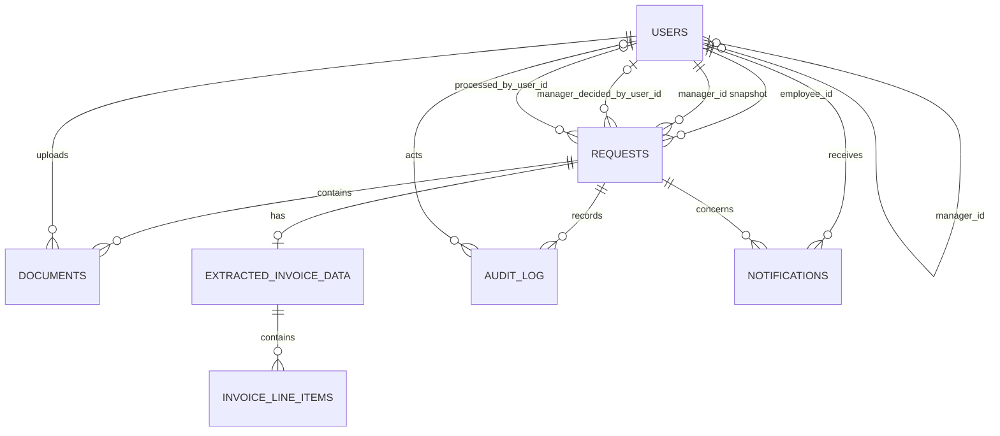

# Orbis Flow — Stage 5 Database Schema

- **Database:** PostgreSQL
- **Scope:** Logical schema design; SQL snippets are illustrative, not runnable migrations
- **Sources:** `docs/PRD.md`, `docs/rbac.md`, `docs/user-stories.md`, `docs/architecture.md`

PostgreSQL is the source of truth. Redis stores only disposable dashboard-query cache entries and has no schema in this document. (Architecture §5; PRD §7 Scalability and Reliability)

## 1. ER Diagram



The six RBAC resources map to `users`, `requests`, `documents`, `extracted_invoice_data`, `notifications`, and `audit_log`. `invoice_line_items` is an implementation child of Extracted Invoice Data, not a seventh permission-bearing resource. (RBAC §1)

## 2. Constrained Types

```sql
CREATE TYPE user_role AS ENUM ('employee', 'manager', 'finance');

CREATE TYPE request_status AS ENUM (
  'uploaded_extracting',
  'employee_review',
  'manager_review',
  'rejected',
  'finance_review',
  'processed'
);

CREATE TYPE payment_status AS ENUM ('paid', 'scheduled');
```

`uploaded_extracting` is the database-safe name for the PRD's combined `uploaded/extracting` state. PostgreSQL ENUMs are selected because roles, workflow states, and payment outcomes are deliberately fixed and non-configurable; they prevent invalid free-text values at the storage boundary. Adding values would require an explicit future migration, which is desirable for these closed MVP sets. (WF-01, WF-06; RBAC §5; PRD §3 Non-Goals)

All primary keys below are application-generated UUIDs with no database default. Timestamps use `timestamptz` and default to `now()` where stated. Monetary values use `numeric(19,4)` to avoid floating-point error; the PRD defines no currency or positivity rule, so neither is invented here.

## 3. Table Definitions

### 3.1 `users`

```sql
users (
  id                uuid          NOT NULL PRIMARY KEY,
  login_identifier  varchar(255)  NOT NULL UNIQUE,
  password_hash     text          NOT NULL,
  role              user_role     NOT NULL,
  manager_id        uuid          NULL
      REFERENCES users(id) ON DELETE RESTRICT,
  created_at        timestamptz   NOT NULL DEFAULT now(),
  updated_at        timestamptz   NOT NULL DEFAULT now(),

  CHECK (manager_id IS NULL OR manager_id <> id),
  CHECK (role = 'employee' OR manager_id IS NULL)
)
```

`login_identifier` remains neutral because AUTH-01 does not choose email versus username. `password_hash` supports salted-hash storage. `role` implements the single-enum RBAC recommendation; no permissions table exists. `manager_id` is nullable because it is meaningful only for Employees and is populated manually by seed/admin insert. A foreign key cannot prove that the referenced row has role `manager` without a trigger, so Spring and seed validation must enforce that cross-row rule. (AUTH-01, AUTH-05, WF-02; RBAC §§2, 5)

### 3.2 `requests`

```sql
requests (
  id                          uuid              NOT NULL PRIMARY KEY,
  employee_id                 uuid              NOT NULL
      REFERENCES users(id) ON DELETE RESTRICT,
  manager_id                  uuid              NOT NULL
      REFERENCES users(id) ON DELETE RESTRICT,
  status                      request_status    NOT NULL DEFAULT 'uploaded_extracting',
  version                     bigint            NOT NULL DEFAULT 0 CHECK (version >= 0),

  manager_decision            varchar(8)        NULL
      CHECK (manager_decision IN ('approved', 'rejected')),
  manager_decided_by_user_id  uuid              NULL
      REFERENCES users(id) ON DELETE RESTRICT,
  manager_decided_at          timestamptz       NULL,
  rejection_reason            text              NULL,

  payment_status              payment_status    NULL,
  processed_by_user_id        uuid              NULL
      REFERENCES users(id) ON DELETE RESTRICT,
  processed_at                timestamptz       NULL,

  created_at                  timestamptz       NOT NULL DEFAULT now(),
  updated_at                  timestamptz       NOT NULL DEFAULT now(),

  CHECK (
    (status IN ('uploaded_extracting', 'employee_review', 'manager_review')
      AND manager_decision IS NULL
      AND manager_decided_by_user_id IS NULL
      AND manager_decided_at IS NULL
      AND rejection_reason IS NULL)
    OR
    (status = 'rejected'
      AND manager_decision = 'rejected'
      AND manager_decided_by_user_id IS NOT NULL
      AND manager_decided_at IS NOT NULL
      AND rejection_reason IS NOT NULL
      AND length(trim(rejection_reason)) > 0)
    OR
    (status IN ('finance_review', 'processed')
      AND manager_decision = 'approved'
      AND manager_decided_by_user_id IS NOT NULL
      AND manager_decided_at IS NOT NULL
      AND rejection_reason IS NULL)
  ),
  CHECK (
    (status = 'processed'
      AND payment_status IS NOT NULL
      AND processed_by_user_id IS NOT NULL
      AND processed_at IS NOT NULL)
    OR
    (status <> 'processed'
      AND payment_status IS NULL
      AND processed_by_user_id IS NULL
      AND processed_at IS NULL)
  )
)
```

`employee_id` supports owner scoping. `manager_id` is a **snapshot copied from `users.manager_id` when the Request is created**. This is a deliberate design decision: changing an Employee's current Manager affects future Requests only and cannot silently transfer an in-flight approval, historical read scope, or audit context. The tradeoff is duplicated manager data, but stable authorization outweighs that small cost; Spring must reject Request creation unless `employee_id` has role `employee` and its assigned `manager_id` has role `manager`. (WF-02, WF-03; RBAC §§2–4)

Decision columns make Manager approval/rejection and its required reason explicit. Processing columns enforce the all-or-nothing timestamp, Finance actor, and fixed payment status tuple. Spring additionally verifies that decision and processing actor rows have `manager` and `finance` roles respectively. `created_at` supplies submission date; `updated_at` supplies stable recent-activity ordering. (WF-03 through WF-06, DASH-01 through DASH-03; RBAC §3)

### 3.3 `documents`

```sql
documents (
  id                   uuid          NOT NULL PRIMARY KEY,
  request_id           uuid          NOT NULL
      REFERENCES requests(id) ON DELETE RESTRICT,
  uploaded_by_user_id  uuid          NOT NULL
      REFERENCES users(id) ON DELETE RESTRICT,
  s3_object_key        text          NOT NULL UNIQUE,
  original_filename    text          NOT NULL,
  mime_type            varchar(32)   NOT NULL
      CHECK (mime_type IN ('application/pdf', 'image/jpeg', 'image/png')),
  file_size_bytes      bigint        NOT NULL
      CHECK (file_size_bytes > 0 AND file_size_bytes <= 10485760),
  is_current           boolean       NOT NULL DEFAULT true,
  created_at           timestamptz   NOT NULL DEFAULT now()
)
```

The table separates private S3 identity from Request metadata and supports original/replacement documents without deleting history. MIME and 10 MB checks mirror backend validation; `uploaded_by_user_id` and `request_id` support ownership checks. Exactly one current document per Request is enforced by a partial unique index in Section 6. (DOC-01 through DOC-04, DOC-06; RBAC §§1–3)

### 3.4 `extracted_invoice_data`

```sql
extracted_invoice_data (
  id                 uuid           NOT NULL PRIMARY KEY,
  request_id         uuid           NOT NULL UNIQUE
      REFERENCES requests(id) ON DELETE RESTRICT,
  schema_version     varchar(32)    NOT NULL,
  extraction_status  varchar(16)    NOT NULL DEFAULT 'pending'
      CHECK (extraction_status IN ('pending', 'succeeded', 'failed')),
  vendor             text           NULL,
  total_amount       numeric(19,4)  NULL,
  invoice_date       date           NULL,
  validation_flags   jsonb          NOT NULL DEFAULT '[]'::jsonb
      CHECK (jsonb_typeof(validation_flags) = 'array'),
  failure_category   varchar(64)    NULL,
  created_at         timestamptz    NOT NULL DEFAULT now(),
  updated_at         timestamptz    NOT NULL DEFAULT now(),

  CHECK (
    (extraction_status = 'failed' AND failure_category IS NOT NULL)
    OR
    (extraction_status <> 'failed' AND failure_category IS NULL)
  )
)
```

The one-to-one row stores versioned OCR results and recoverable attempt state. Extracted business fields remain nullable because missing values are a valid flagged outcome, not a database error. `validation_flags` carries field/rule results without defining new workflow states; `failure_category` is non-sensitive diagnostic context. Employee corrections update this row only in RBAC-permitted states and produce an audit event. (AI-01, AI-03 through AI-07; RBAC §§2–3; Architecture §2)

### 3.5 `invoice_line_items`

```sql
invoice_line_items (
  id                         uuid           NOT NULL PRIMARY KEY,
  extracted_invoice_data_id  uuid           NOT NULL
      REFERENCES extracted_invoice_data(id) ON DELETE CASCADE,
  line_number                integer        NOT NULL CHECK (line_number > 0),
  description                text           NOT NULL,
  amount                     numeric(19,4)  NOT NULL,

  UNIQUE (extracted_invoice_data_id, line_number)
)
```

Line items are normalized for deterministic ordering and sum validation. Description and amount implement the minimum extracted shape. Cascading deletion is limited to the technical child relationship; product APIs still expose no DELETE permission. (AI-02, AI-05; RBAC §§1–2)

### 3.6 `notifications`

```sql
notifications (
  id           uuid          NOT NULL PRIMARY KEY,
  user_id      uuid          NOT NULL
      REFERENCES users(id) ON DELETE RESTRICT,
  request_id   uuid          NOT NULL
      REFERENCES requests(id) ON DELETE RESTRICT,
  type         varchar(32)   NOT NULL CHECK (type IN (
      'employee_correction',
      'employee_rejection',
      'manager_assignment',
      'finance_assignment',
      'processed'
  )),
  read_at      timestamptz   NULL,
  created_at   timestamptz   NOT NULL DEFAULT now()
)
```

Every notification is owned by one user and links to one independently authorized Request. `read_at IS NULL` represents unread state and avoids competing boolean/timestamp values. The type constraint exactly covers the in-app events in NOTIF-02; no real-time delivery fields are added. (NOTIF-01 through NOTIF-04; RBAC §§2–4)

### 3.7 `audit_log`

```sql
audit_log (
  id                uuid            NOT NULL PRIMARY KEY,
  request_id        uuid            NOT NULL
      REFERENCES requests(id) ON DELETE RESTRICT,
  event_type        varchar(32)     NOT NULL CHECK (event_type IN (
      'upload', 'extraction', 'validation', 'field_correction',
      'routing', 'resubmission', 'approval', 'rejection', 'processing'
  )),
  actor_kind        varchar(8)      NOT NULL
      CHECK (actor_kind IN ('user', 'system')),
  actor_user_id     uuid            NULL
      REFERENCES users(id) ON DELETE RESTRICT,
  previous_status   request_status  NULL,
  resulting_status  request_status  NULL,
  context           jsonb           NOT NULL DEFAULT '{}'::jsonb
      CHECK (jsonb_typeof(context) = 'object'),
  created_at        timestamptz     NOT NULL DEFAULT now(),

  CHECK (
    (actor_kind = 'user' AND actor_user_id IS NOT NULL)
    OR
    (actor_kind = 'system' AND actor_user_id IS NULL)
  )
)
```

The columns implement the required event identity, actor/system actor, before/after state, timestamp, and non-sensitive context. Secret exclusion remains an application validation/logging responsibility because PostgreSQL cannot reliably classify arbitrary JSON content. (AUD-01, AUD-02, AUD-04)

## 4. State-Machine and Concurrency Enforcement

The `request_status` ENUM rejects values outside WF-01's six-state list. Legal transitions remain Spring Boot business rules:

```text
uploaded_extracting -> employee_review | manager_review
employee_review     -> manager_review | uploaded_extracting
manager_review      -> rejected | finance_review
rejected            -> employee_review
finance_review      -> processed
```

An extraction failure leaves the Request in `uploaded_extracting` and sets `extracted_invoice_data.extraction_status = 'failed'`; retry reuses that Request. No other transition is legal. (AI-07, WF-01, WF-02, WF-05, WF-06; Architecture §2)

Every transition uses the caller's previously read version:

```sql
UPDATE requests
SET status = :next_status,
    version = version + 1,
    updated_at = now()
WHERE id = :request_id
  AND status = :expected_status
  AND version = :expected_version;
```

Exactly one updated row means the caller may continue; zero rows means stale, duplicate, or wrong-state conflict. The transition, related decision/extraction/payment fields, and `audit_log` insert execute in one transaction. RBAC ownership/assignment/state checks occur before and inside that transaction as applicable. (WF-07, AUD-01; RBAC §3; Architecture §5)

## 5. Audit-Log Immutability

For the MVP, no mutation trigger is added. The Spring application database role receives `SELECT` and `INSERT` on `audit_log`, but no `UPDATE`, `DELETE`, or `TRUNCATE`; product code exposes no audit mutation operation. A separate schema-owner role used by controlled migrations may own the table but is never supplied to the running application.

This append-only grant model blocks accidental application mutation while remaining simpler to test and operate than triggers. PostgreSQL backups remain the recovery mechanism; audit rows are retained indefinitely for the MVP. (AUD-03; RBAC §§2, 4; PRD §9; Architecture §5)

## 6. Indexes

```sql
-- Employee dashboard: owner + status filter + deterministic keyset/order tie-break
CREATE INDEX idx_requests_employee_status_created
  ON requests (employee_id, status, created_at DESC, id DESC);

-- Assigned Manager queue and history
CREATE INDEX idx_requests_manager_status_updated
  ON requests (manager_id, status, updated_at DESC, id DESC);

-- Finance queue/recent processing
CREATE INDEX idx_requests_finance_status_updated
  ON requests (status, updated_at DESC, id DESC)
  WHERE status IN ('finance_review', 'processed');

-- Team membership join used for Manager aggregate activity
CREATE INDEX idx_users_manager
  ON users (manager_id, id)
  WHERE role = 'employee';

-- One current document and efficient Request attachment lookup
CREATE UNIQUE INDEX uq_documents_current_request
  ON documents (request_id) WHERE is_current;
CREATE INDEX idx_documents_request_created
  ON documents (request_id, created_at DESC, id DESC);

-- Unread/recent notification reads
CREATE INDEX idx_notifications_user_read_created
  ON notifications (user_id, read_at, created_at DESC, id DESC);

-- Chronological Request history
CREATE INDEX idx_audit_request_created
  ON audit_log (request_id, created_at, id);
```

The unique constraints on `extracted_invoice_data.request_id`, `s3_object_key`, and line-item `(extracted_invoice_data_id, line_number)` already create supporting indexes. The listed indexes align leftmost columns with RBAC ownership/assignment predicates, then status filters and deterministic dashboard ordering/pagination. Index count is intentionally limited for MVP write cost. (DASH-01 through DASH-04; NOTIF-03; AUD-03; RBAC §§2–3)

## 7. Explicit Non-Decisions

Deferred to Stage 6/implementation:

- Migration tool and versioning convention (Flyway versus Liquibase); no migration file is created here.
- Seed-data scripts for the three roles, test accounts, and Employee-to-Manager assignments.
- JDBC connection-pool sizing, timeouts, credentials, and environment-specific database configuration.
- Exact Spring entity mappings, repository queries, transaction annotations, and database-grant scripts.
- UUID generation library, timestamp update mechanism, JSON serialization, and keyset-versus-offset pagination implementation.

The schema intentionally defines no Redis structures, permissions table, configurable workflow tables, payment-installment tables, or resources beyond the PRD/RBAC scope.
